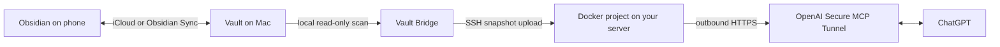

# Vault Bridge

Read-only access to a private Obsidian vault from ChatGPT.

Vault Bridge is a macOS application that copies a filtered snapshot of a vault
to an isolated Docker project on your own Linux server. OpenAI Secure MCP
Tunnel connects that private MCP server to ChatGPT without a public port or
inbound access to the Mac.

[Install with Codex](docs/install-with-codex.md) ·
[Releases](https://github.com/kizz-tech/vault-mcp-bridge/releases) ·
[Architecture](docs/architecture.md) ·
[Security](SECURITY.md)

The current Apple Silicon preview is integrity-checked but not Developer ID
signed or notarized. Do not bypass a macOS security warning for an untrusted
download. The supported preview path is the Codex installation runbook.

## What it does

- selects any local Obsidian vault;
- connects to an existing Linux server over SSH;
- installs an isolated, resource-bounded Docker Compose project;
- publishes complete vault snapshots on startup, every five minutes, after
  resume, or on demand;
- exposes only `search` and `fetch` to ChatGPT;
- shows connection state, synchronization state, and an aggregate activity
  log in one desktop application.
- provides one redacted `doctor --json` check for the vault, SSH/runtime,
  OpenAI tunnel, and last synchronization result.

The application does not write to the vault. It does not expose iCloud, a local
filesystem, the Docker socket, a shell, or a public server port.

## Install

For an agent-guided installation, open
[docs/install-with-codex.md](docs/install-with-codex.md), copy the prompt, and
paste it into Codex. The runbook keeps account login, credentials, and the
first SSH fingerprint approval with the owner.

Requirements:

- Apple Silicon Mac;
- Linux server reachable over SSH;
- Docker Engine with Docker Compose on the server;
- access to OpenAI Secure MCP Tunnels and the corresponding ChatGPT connection
  surface.

Release downloads include a DMG, ZIP, and SHA-256 manifest. Read the release
notes before installing; preview binaries are not yet notarized.

## Architecture



The vault on the Mac remains canonical. The server copy is replaceable and
activates as one complete generation after validation. Phone-to-Mac freshness
remains the responsibility of iCloud or Obsidian Sync.

## ChatGPT tools

The MCP surface is deliberately small:

- `search({ query })` returns bounded matches with opaque IDs;
- `fetch({ id })` returns one document from the active snapshot.

There is no model-facing browse-all, write, delete, sync-control, raw-path,
SQL, or shell tool. Vault content is treated as untrusted source data.

Secure MCP Tunnel supports private connections and developer-mode testing. It
does not publish Vault Bridge to the public ChatGPT app catalog.

## Security model

- Hidden directories, `.obsidian`, `.git`, `node_modules`, and symlinks are
  excluded by default.
- SSH host identity is approved once and pinned.
- The server process is non-root and resource-bounded, with no host ports,
  host mounts, privileged mode, or Docker socket.
- The OpenAI runtime key is accepted through the native UI or stdin and stored
  with macOS encrypted storage. It is not accepted in setup JSON or process
  arguments.
- Activity records counts, bytes, duration, trigger, generation, and a bounded
  component/error code when an operation fails. It does
  not record note contents, titles, queries, credentials, addresses, or local
  paths.
- The local journal retains at most 200 events. Container logs rotate at
  8 MiB × 3 files, and temporary deployment secrets are removed after every
  setup attempt.
- The VPS administrator and Docker daemon can inspect the replica. Use a
  server you trust.

See the [threat model](docs/threat-model.md) and
[deployment contract](deploy/secure-tunnel/README.md). Report vulnerabilities
through [SECURITY.md](SECURITY.md), without vault evidence in a public issue.

## Status

| Surface | Current preview |
| --- | --- |
| macOS | Apple Silicon; not notarized |
| Vault data | Markdown, Canvas, and Bases text |
| MCP | Read-only `search` and `fetch` |
| Sync | Startup, five-minute schedule, resume, manual |
| Runtime | Docker Compose; Linux amd64 and arm64 |
| Installation | Codex runbook or source build |

The public roadmap is tracked in
[GitHub Issues](https://github.com/kizz-tech/vault-mcp-bridge/issues).

## Development

Requires Node.js 24+ and pnpm 10.

```sh
pnpm install --frozen-lockfile
pnpm check
pnpm dev
```

Use only synthetic fixtures during development. The repository is a TypeScript
monorepo:

- `apps/desktop` — macOS application and deployment owner;
- `apps/agent` — vault scanner and snapshot publisher;
- `apps/server` — SQLite/FTS5 store and MCP server;
- `deploy/secure-tunnel` — isolated Docker Compose deployment;
- `packages/*` — shared contracts and libraries;
- `apps/edge`, `deploy/runtime` — advanced public HTTPS/OAuth mode.

See [CONTRIBUTING.md](CONTRIBUTING.md). Licensed under
[Apache-2.0](LICENSE).
