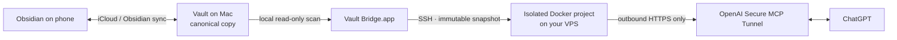

<div align="center">


# Vault Bridge

**Give ChatGPT read-only access to a private Obsidian vault — without exposing
your Mac or opening a public port on your server.**

[](https://github.com/kizz-tech/vault-mcp-bridge/releases)
[](LICENSE)


[**Install with Codex**](docs/install-with-codex.md) ·
[Download preview](https://github.com/kizz-tech/vault-mcp-bridge/releases) ·
[Architecture](docs/architecture.md) ·
[Security](SECURITY.md)

</div>

Vault Bridge is a small macOS application for people who want their own notes
available inside ChatGPT without turning an Obsidian vault into a public web
service. Choose a vault, connect a Linux server over SSH, connect an
owner-controlled OpenAI Secure MCP Tunnel, and select **Set up**.

> [!IMPORTANT]
> `v0.1.0` is an early preview for Apple Silicon. Its downloadable macOS
> artifacts are integrity-checked but not Developer ID signed or notarized.
> Use the Codex installation flow for the current supported setup path. Do not
> bypass macOS security warnings to run an untrusted download.

## Why it is different

| Principle | Product behavior |
| --- | --- |
| Your vault stays canonical | The Mac only reads the selected vault. The VPS receives a replaceable snapshot, never iCloud credentials or filesystem access. |
| No inbound exposure | The runtime has no published host ports. OpenAI's tunnel client initiates outbound HTTPS from the isolated Docker project. |
| Read-only means read-only | ChatGPT gets exactly `search` and `fetch`. There is no write, delete, shell, raw path, SQL, or sync-control tool. |
| Built for non-developers | Copy one prompt into Codex. The agent performs routine setup while account consent, credentials, and the SSH fingerprint stay under owner control. |

OpenAI documents Secure MCP Tunnel as an outbound-only way to connect private
MCP servers to supported products without exposing them to the public internet.
Vault Bridge packages that infrastructure into one owner-facing application.

## Start here

### I do not want to use a terminal

Open [Install with Codex](docs/install-with-codex.md), copy the single prompt,
and paste it into Codex. The versioned runbook tells the agent how to install,
configure, verify, and safely stop when human approval is required.

### I want to inspect the preview artifacts

Open [GitHub Releases](https://github.com/kizz-tech/vault-mcp-bridge/releases).
Every release includes a DMG, ZIP, and a machine-readable SHA-256 manifest.
The `v0.1.0` binaries are not notarized; their release notes state the exact
validation level and limitations.

Requirements for the current product:

- an Apple Silicon Mac that can read the vault;
- a Linux VPS reachable through SSH with Docker Engine and Docker Compose;
- an OpenAI account or workspace with Secure MCP Tunnels and the required
  ChatGPT connection surface enabled.

## How it works



Phone-to-Mac freshness remains an iCloud or Obsidian responsibility. Vault
Bridge publishes only the files visible on the Mac during a successful scan.
The app checks at startup, every five minutes while running, after **Resume**,
or when the owner selects **Sync now**.

The full-screen Activity view records aggregate added, modified, removed, and
unchanged counts, bytes, duration, trigger, and snapshot generation. It never
records note text, titles, search queries, server addresses, credentials, or
local paths.

## The ChatGPT surface

The remote MCP exposes two tools:

- `search({ query })` — bounded full-text search with opaque result IDs;
- `fetch({ id })` — retrieve one document by an opaque ID.

There is no model-facing browse-all operation. IDs do not reveal local paths,
and knowing an ID does not grant access outside the active snapshot. Content
returned from the vault is marked and handled as untrusted source data.

Secure MCP Tunnel is for private connections and developer-mode testing; it is
not public ChatGPT catalog distribution. A future public plugin would require a
separate stable HTTPS endpoint, authentication, review, and policy surface.

## Security boundary

- Hidden directories, `.obsidian`, `.git`, `node_modules`, and symlinks are
  excluded by default.
- Snapshots are complete generations and activate atomically.
- The VPS runtime is non-root, resource-bounded, read-only where practical,
  and has no host ports, host mounts, Docker socket, or privileged mode.
- The OpenAI runtime key enters the app through stdin or the native UI and is
  stored through macOS encrypted storage. It is not accepted in setup JSON or
  process arguments.
- The first SSH identity is an explicit owner approval; the exact fingerprint
  and host-key algorithm are pinned for later connections.
- The VPS administrator and Docker daemon can inspect replica data. Use a VPS
  you trust; containers are not a hostile multi-tenant security boundary.

Read the [threat model](docs/threat-model.md),
[architecture](docs/architecture.md), and
[Secure Tunnel deployment contract](deploy/secure-tunnel/README.md) before
using sensitive material. Report vulnerabilities privately through
[SECURITY.md](SECURITY.md), never with vault evidence in a public issue.

## Current status

| Surface | `v0.1.0` |
| --- | --- |
| macOS desktop | Apple Silicon preview; unsigned/not notarized |
| Vault formats | Markdown, Canvas, and Bases text |
| MCP tools | Read-only `search` and `fetch` |
| Sync | Startup + five-minute schedule + resume + manual |
| Remote runtime | Docker Compose on Linux; amd64/arm64 image |
| Installation | Agent-first Codex runbook or source build |
| Vault writes | Intentionally absent |

The public roadmap lives in
[GitHub Issues](https://github.com/kizz-tech/vault-mcp-bridge/issues). The first
distribution priorities are signed/notarized macOS artifacts, clean-machine
agent-install acceptance tests, and additional local publisher platforms.

## Development

Requirements are Node.js 24+ and pnpm 10.

```sh
pnpm install --frozen-lockfile
pnpm check
pnpm dev
```

Use only synthetic fixtures during development. The Electron renderer loads
from `vaultbridge://app`, with sandboxing, context isolation, disabled Node
integration, blocked navigation/webviews, and an explicit IPC allowlist.

The repository is a TypeScript monorepo:

- `apps/desktop` — the one-launch macOS product and SSH deployment owner;
- `apps/agent` — scanner and snapshot synchronization;
- `apps/server` — SQLite/FTS5 snapshot store and private MCP server;
- `deploy/secure-tunnel` — the isolated Compose deployment;
- `packages/*` — contracts, scanning, deployment, and orchestration libraries;
- `apps/edge` and `deploy/runtime` — an advanced public HTTPS/OAuth mode.

See [CONTRIBUTING.md](CONTRIBUTING.md) for product invariants and validation
commands. Vault Bridge is licensed under [Apache-2.0](LICENSE).
